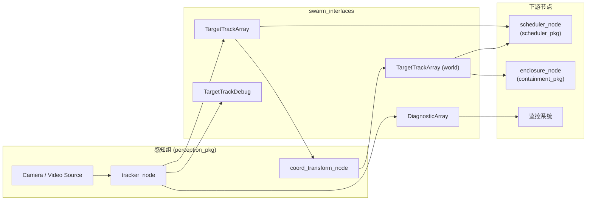
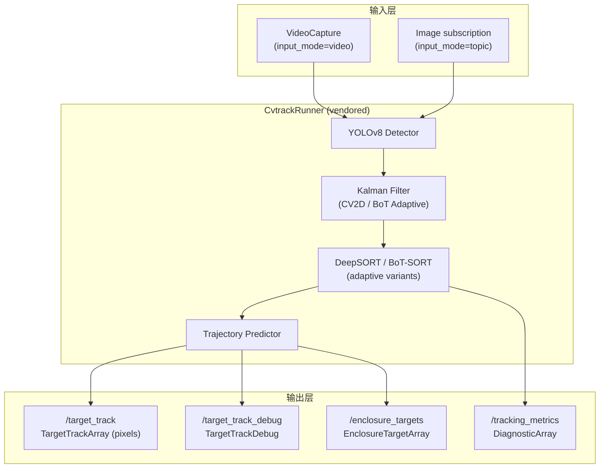
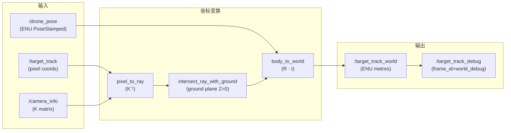
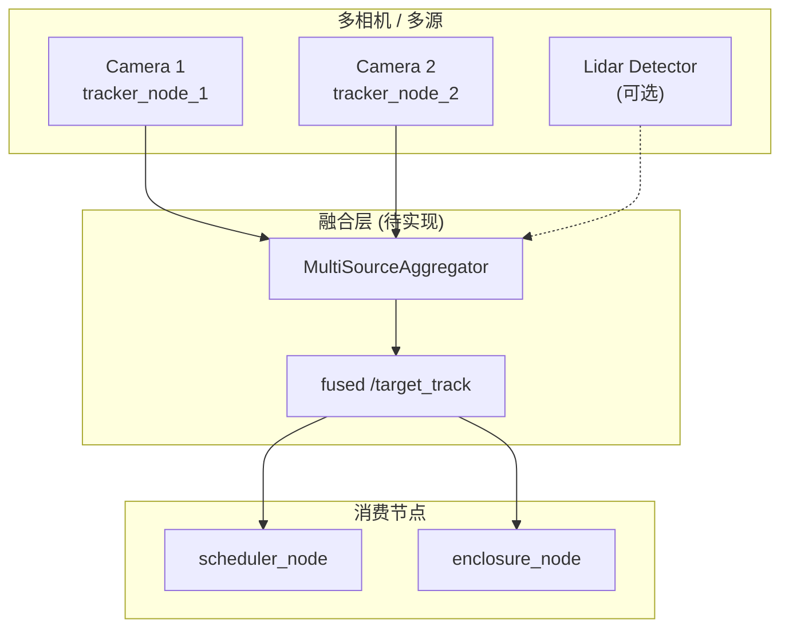

# 感知组架构图

本文档使用 Mermaid 格式展示感知组各节点间的数据流与拓扑关系。
节点名称与代码中的 ROS 节点名严格对应。

---

## 1. 整体数据流

---

## 2. tracker_node 内部结构

---

## 3. coord_transform_node 数据转换

---

## 4. 多相机 / 多源融合（扩展）

> **注意**: `MultiSourceAggregator` 目前尚未实现（B1/B2 融合部分遗留项）。
> 上图展示目标架构，当前为规划参考。

---

## 5. 节点清单与话题映射

| 节点名 | 包 | 订阅话题 | 发布话题 | 备注 |
|--------|-----|----------|----------|------|
| `tracker_node` | perception_pkg | `/camera/image` (可选) | `/target_track` | 像素坐标输出 |
| `tracker_node` | perception_pkg | — | `/target_track_debug` | 调试增强（仅 `enable_debug_topics:=True`） |
| `tracker_node` | perception_pkg | — | `/tracking_metrics` | 诊断指标（仅 `enable_debug_topics:=True`） |
| `tracker_node` | perception_pkg | — | `/enclosure_targets` | 封控接口（仅 `enclosure.enabled:=True`） |
| `coord_transform_node` | perception_pkg | `/target_track` | `/target_track_world` | 像素→世界坐标 |
| `coord_transform_node` | perception_pkg | `/camera_info` | `/target_track_debug` | world frame debug |
| `coord_transform_node` | perception_pkg | `/drone_pose` | — | 机体 ENU 坐标 |
| `scheduler_node` | scheduler_pkg | `/target_track_world` | — | 调度决策 |
| `enclosure_node` | containment_pkg | `/target_track_world` | — | 封控决策 |

---

## 6. 关键参数（参考）

### tracker_node

| 参数 | 默认值 | 说明 |
|------|--------|------|
| `tracker.kind` | `deepsort_cascade` | deepsort / botsort / deepsort_cascade |
| `enable_debug_topics` | `True` | 启用 /target_track_debug 和 /tracking_metrics |
| `metrics_period_ms` | `1000` | /tracking_metrics 发布周期（ms） |
| `detector.conf` | `0.15` | 检测置信度阈值 |
| `detector.imgsz` | `480` | 推理图像尺寸 |

### coord_transform_node

| 参数 | 默认值 | 说明 |
|------|--------|------|
| `ground_altitude` | `0.0` | 地面高度（ENU Z，m） |
| `camera_mount_yaw` | `0.0` | 相机安装偏航角（rad） |
| `max_pose_age_s` | `0.5` | 超过此时间的 pose 被视为过期 |

---

*本文档节点名称与代码中的 ROS 节点名（`tracker_node`、`coord_transform_node`、`scheduler_node`、`enclosure_node`）严格一致。*
