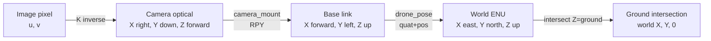

# 坐标转换接入指南

感知组在 `/target_track` 发布**像素坐标**的 `TargetTrackArray`；调度组、封控组需要**世界米制坐标**。`coord_transform_node` 是两者的桥接节点。

## 启动

### 1. 编译（首次或消息改动后）

```bash
cd /home/hhh/Downloads/Swarm-Control-System/ros2_ws
colcon build --packages-select swarm_interfaces perception_pkg
source install/setup.bash
```

### 2. 启动节点

```bash
# 最简（使用所有默认值）
ros2 run perception_pkg coord_transform_node

# 显式参数
ros2 run perception_pkg coord_transform_node --ros-args \
    -p camera_info_topic:=/uav/camera/camera_info \
    -p drone_pose_topic:=/uav/odometry \
    -p input_topic:=/target_track \
    -p output_topic:=/target_track_world \
    -p ground_altitude:=0.0 \
    -p max_pose_age_s:=0.5 \
    -p camera_mount_roll:=0.0 \
    -p camera_mount_pitch:=0.0 \
    -p camera_mount_yaw:=0.0
```

> ⚠️ 节点启动时不会发布任何世界坐标，直到 **同时** 收到 `CameraInfo` 和最新的 `drone_pose` 为止。这避免了「无姿态的虚假坐标」污染下游。

## 参数说明

| 参数 | 默认 | 说明 |
| --- | --- | --- |
| `camera_info_topic` | `/camera_info` | CameraInfo 源；只读取一次后缓存 |
| `drone_pose_topic` | `/drone_pose` | `geometry_msgs/PoseStamped`，ENU 米制 |
| `input_topic` | `/target_track` | 像素坐标 `TargetTrackArray` 输入 |
| `output_topic` | `/target_track_world` | 世界米制 `TargetTrackArray` 输出 |
| `debug_topic` | `/target_track_debug` | 调试用（与主输出相同内容，独立 frame_id） |
| `ground_altitude` | 0.0 | 地面海拔（ENU Z，米）。多海拔场景下由用户覆盖 |
| `max_pose_age_s` | 0.5 | 超过该秒数的 pose 视为过期，丢弃本帧 |
| `camera_mount_roll` | 0.0 | 相机相对机身的 roll（弧度） |
| `camera_mount_pitch` | 0.0 | 相机相对机身的 pitch（弧度） |
| `camera_mount_yaw` | 0.0 | 相机相对机身的 yaw（弧度） |
| `frame_id` | `world` | 输出 `header.frame_id` |
| `publish_debug` | true | 是否额外发布 debug topic |

## 坐标系约定



- **像素系**（u, v）：图像左上角为原点，单位 px。
- **相机光学系**（Xc, Yc, Zc）：X 右、Y 下、Z 前；来自 `CameraInfo.K`。
- **机身系 / base_link**（Xb, Yb, Zb）：X 前、Y 左、Z 上（ROS REP-145）。
- **世界系 / ENU**（X, Y, Z）：X 东、Y 北、Z 上。
- **地面假设**：`Z_world = ground_altitude`（参数，默认 0）。

## 数据流示例

```
   ┌──────────────────┐  /target_track (px)         ┌──────────────────┐
   │  perception_pkg  │ ──────────────────────────► │ coord_transform_ │
   │  tracker_node    │   TargetTrackArray          │      node        │
   └──────────────────┘                             └──────────────────┘
                                                          │   ▲
                              /camera_info (K)            │   │ /drone_pose
                                                          ▼   │ (PoseStamped)
                                            ┌──────────────────┐
                                            │  /target_track_  │
                                            │     world        │
                                            │   (m, ENU)       │
                                            └──────────────────┘
```

## 调试

```bash
# 1. 看是否收到 camera_info
ros2 topic echo /camera_info --once

# 2. 看是否收到 drone_pose
ros2 topic echo /drone_pose --once

# 3. 看世界坐标输出
ros2 topic echo /target_track_world

# 4. 看带 frame_id='world_debug' 的 debug 输出
ros2 topic echo /target_track_debug

# 5. 节点日志（注意 info 级别的 ready / intrinsics cached 日志）
ros2 run perception_pkg coord_transform_node --ros-args --log-level info
```

## 测试

```bash
cd /home/hhh/Downloads/Swarm-Control-System/ros2_ws/src/perception_pkg
python3 -m pytest tests/test_coord_transform.py -v
```

测试只覆盖纯数学函数（`pixel_to_ray`、`intersect_ray_with_ground`、
`quaternion_to_matrix`、`body_to_world` 等），不实例化 ROS 节点。

## 已知限制

1. **单相机**：当前实现把每个 track 视为同一台相机的观测；多相机融合不在 C3 范围。
2. **单无人机姿态**：所有 track 都使用同一份 `drone_pose`；多机编队需要每个机载节点订阅各自的 pose。
3. **地面平面假设**：忽略目标自身高度（树木顶部、车顶、楼层等）；高层建筑/显著地形起伏场景下需改用 DEM 或 3D bbox 中心。
4. **drone_pose 坐标系必须 ENU**：本节点按 ENU 解释 `PoseStamped.position`（X 东, Y 北, Z 上）。若上游发布 NED，需在订阅前做轴交换。
5. **不做时间同步**：`drone_pose` 是「最近一条」，与 `/target_track` 的 stamp 不严格对齐；高速运动场景建议后续用 `message_filters` 做时间同步。
6. **像素畸变未补偿**：当前用线性 `K` 做反投影，未使用 `CameraInfo.D`（畸变系数）。若相机畸变显著，需在反投影前做去畸变。
